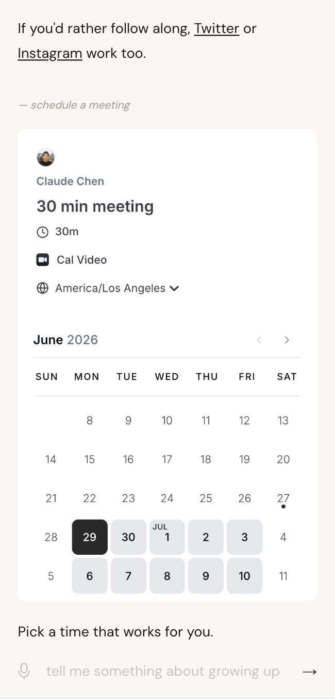
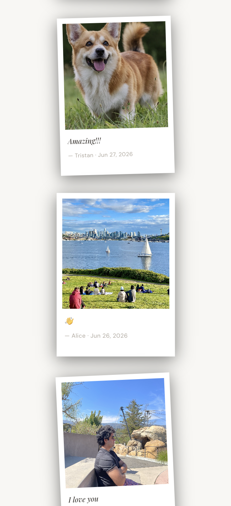

# claudechen.me

Personal website. An AI version of me answers questions about who I am and what I'm building.

## Features

- **Answers questions in my voice** — visitors chat with an AI stand-in that knows my background, work, and story


- **Won't hallucinate** — for anything outside its knowledge it defers to the real me rather than inventing an answer


- **Embeds photos inline** — ask something visual ("are you secretly ugly?") and a real photo appears in the conversation


- **Meeting booking** — ask to schedule a call and a Cal.com embed appears inline in the conversation



- **Inline guestbook** — ask to leave a note and a polaroid card appears in the chat; fill in a message, add a photo, and post without leaving the page


- **Polaroid photo wall** — all guestbook entries live at /guestbook as a wall of rotating polaroids with a lightbox on click



## Stack

- **Framework:** Next.js 14 (App Router), TypeScript
- **Styling:** Tailwind CSS
- **AI:** Anthropic Claude (claude-sonnet-4-6) with tool use
- **Database:** Upstash Redis (guestbook entries)
- **Storage:** Vercel Blob (guestbook photos)
- **Analytics:** PostHog
- **Deployment:** Vercel

## Dev

```bash
npm install
npm run dev     # localhost:3131
npm run deploy  # git push → Vercel
```

## Env vars

```
personalwebsite_KV_REST_API_URL
personalwebsite_KV_REST_API_TOKEN
BLOB_READ_WRITE_TOKEN
BLOB_STORE_ID
ANTHROPIC_API_KEY
ADMIN_SECRET
NEXT_PUBLIC_POSTHOG_KEY
NEXT_PUBLIC_POSTHOG_HOST
```
